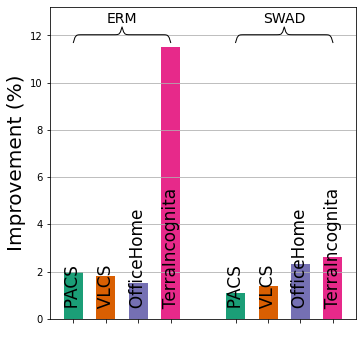
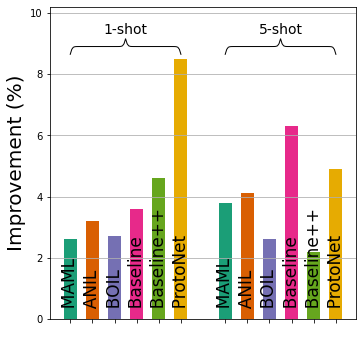
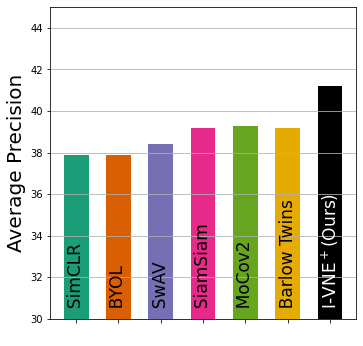

# (CVPR 2023) VNE: An Effective Method for Improving Deep Representation by Manipulating Eigenvalue Distribution

This repository provides a Official PyTorch implementation of our CVPR 2023 paper ***VNE: An Effective Method for Improving Deep Representation by Manipulating Eigenvalue Distribution.***

+ [CVPR 2023 paper (will be made available)](https://...)
+ [arXiv version (will be made available)](https://...)


## Abstract
Since the introduction of deep learning, a wide scope of representation properties, such as decorrelation, whitening, disentanglement, rank, isotropy, and mutual information, have been studied to improve the quality of representation. However, manipulating such properties can be challenging in terms of implementational effectiveness and general applicability. To address these limitations, we propose to regularize von Neumann entropy (VNE) of representation. First, we demonstrate that the mathematical formulation of VNE is superior in effectively manipulating the eigenvalues of the representation autocorrelation matrix. Then, we demonstrate that it is widely applicable in improving state-of-the-art algorithms or popular benchmark algorithms by investigating domain-generalization, meta-learning, self-supervised learning, and generative models. In addition, we formally establish theoretical connections with rank, disentanglement, and isotropy of representation. Finally, we provide discussions on the dimension control of VNE and the relationship with Shannon entropy.


## Our contributions:
- We introduce `a novel representation regularization method`, von Neumann entropy of deep representation.
- We describe VNE's `implementational effectiveness`.
- We demonstrate `general applicability` of VNE by improving current state-of-the-art methods in various tasks and achieving a new state-of-the-art performance in self-supervised learning and domain generalization.
- We provide `theoretical connections` by proving that VNE is theoretically connected to rank, disentanglement, and isotropy of representation.

#### Performance improvement is significant and consistent (General applicability of VNE):
<p float="left">




</p>
Performance of state-of-the-art algorithms or popular benchmark algorithms can be further improved by regularizing von Neumann entropy.

- Domain generalization: relative improvements over ERM and SWAD (current state-of-the-art). 
- Meta-learning: relative improvements over six popular benchmark algorithms. 
- Self-supervised learning: performance comparison against the current state-of-the-art algorithms for COCO detection.
- GAN: relative improvements in Fréchet Inception Distance (FID) for seven popular benchmark algorithms.


## Implementation of VNE

VNE can be implemented in a few lines of PyTorch codes in [`vne/__init__.py`](vne/__init__.py):

```py
# N   : batch size
# d   : embedding dimension
# H   : embeddings, Tensor, shape=[N, d]

def get_vne(H):
    Z = torch.nn.functional.normalize(H, dim=1)
    rho = torch.matmul(Z.T, Z) / Z.shape[0]
    eig_val = torch.linalg.eigh(rho)[0][-Z.shape[0]:]
    return - (eig_val * torch.log(eig_val)).nansum()
# the following is equivalent and faster when N < d
def get_vne(H):
    Z = torch.nn.functional.normalize(H, dim=1)
    sing_val = torch.svd(Z / np.sqrt(Z.shape[0]))[1]
    eig_val = sing_val ** 2
    return - (eig_val * torch.log(eig_val)).nansum()
```

You can calculate VNE of a representation matrix `x` by
```py
from vne import get_vne

entropy = get_vne(x)
```

## Utilizing VNE as a regularization loss
Thanks to the implementational effectiveness and theoretical connections, VNE regularizer can effectively control not only von Neumann entropy but also other theoretically related properties, including rank and isotropy.
For a given representation matrix `x`, VNE can be subtracted with the appropriate coefficient `vne_coef` from the main loss, as demonstrated below.
```py
if abs(vne_coef) > 0:
    loss -= vne_coef * get_vne(x)
```
- If `vne_coef>0`, VNE (as well as rank, disentanglement, and isotropy) of a representation can be increased.
- If `vne_coef<0`, VNE (as well as rank, disentanglement, and isotropy) of a representation can be decreased.

For more details, please refer to [VNE regularization using hook](./examples/hook).

## Utilizing VNE as a metric
Our paper proves that VNE is theoretically and empirically connected with rank, disentanglement, and isotropy of a representation.
Therefore, VNE can be a useful proxy of the rank, disentanglement, and isotropy of a representation.

## Examples
As examples of training a representation learning task with VNE, we provide the following [examples](./examples):
+ [I-VNE+ with ImageNet-100](./examples/i-vne+)
+ [VNE regularization using hook](./examples/hook)


## Citation
Please consider citing our work if you find our repository/paper useful.
```
@inproceedings{currently not available
}
```


## Contact

Please contact the author if you have any questions about our repository/paper: Jaeill Kim (`jaeill0704 _AT_ snu.ac.kr`).


