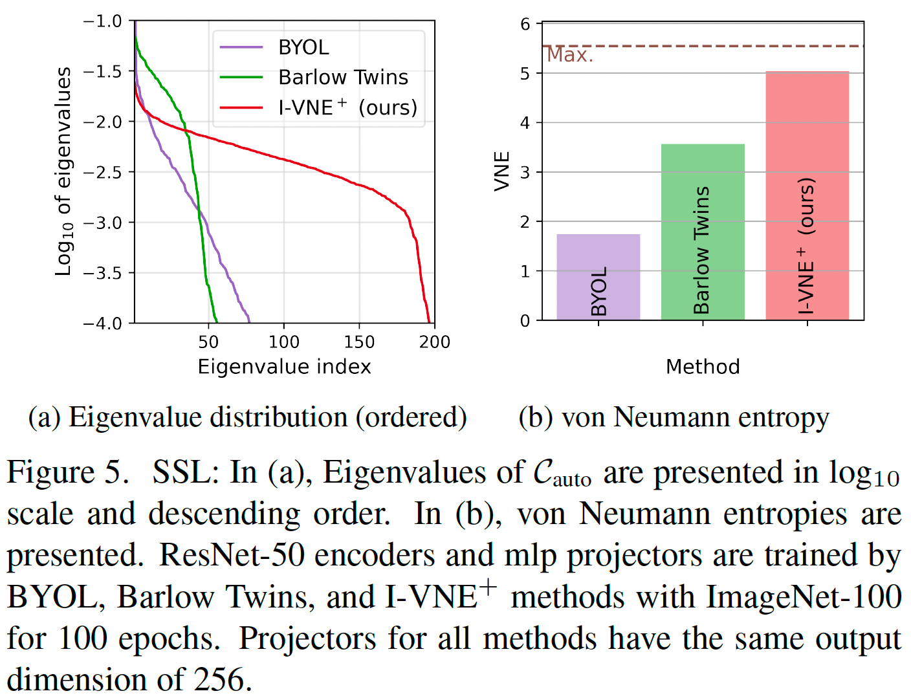
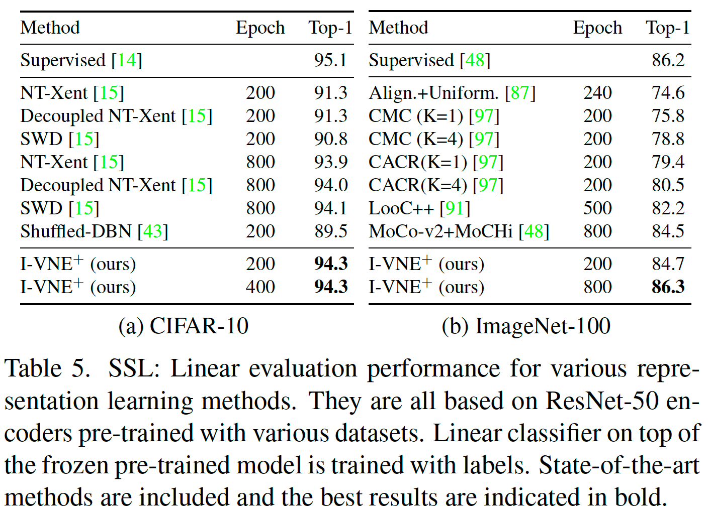
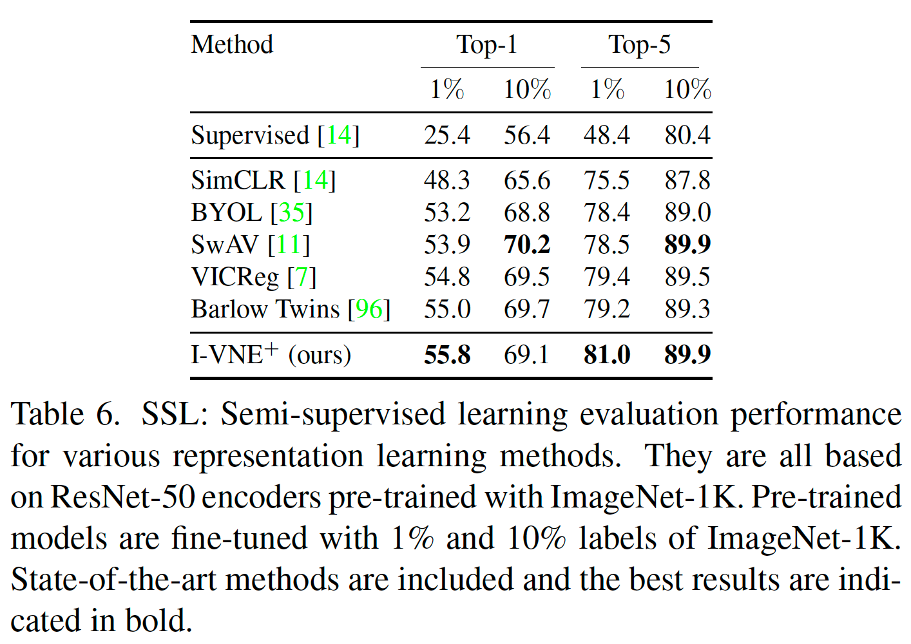
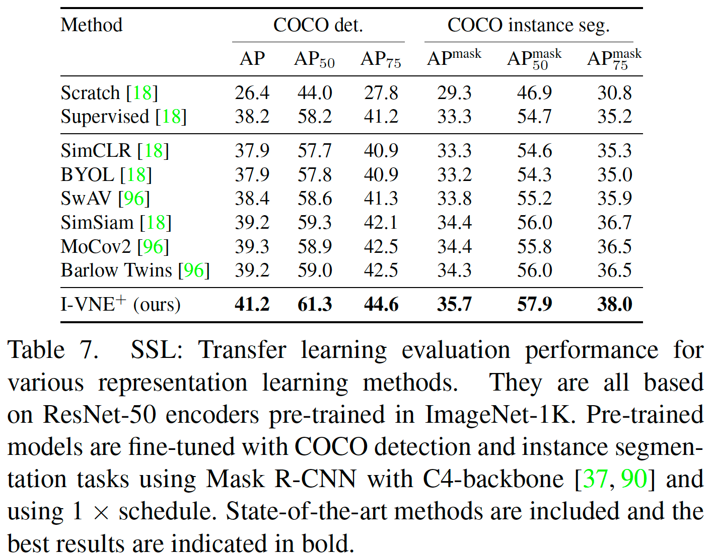

# I-VNE+: A novel method for unsupervised representation learning

Our method involves two key components aimed at improving the quality of learned representations: (1) **Invariance**: maximizing the cosine similarity between positive pairs to enforce invariance across multiple views, and (2) **VNE+**: maximizing the von Neumann entropy to prevent representation collapse. Specifically, by optimizing these objectives jointly, we are able to achieve a more effective and stable learning process, resulting in highly discriminative and transferable feature representations. The loss is expressed as:

$$\mathcal{L}_{\text{I-VNE}^+}=-\alpha_1 \cdot \mathbb{E}_i[\text{sim}({h}^1_i,{h}^2_i)]-\alpha_2 \cdot S(\mathcal{C}_{\text{auto}})$$

Please refer to our paper for more details.

## Analysis

<p align="center">

</p>

## State-of-the-art performance

<p align="center">



</p>


## I-VNE+ in ImageNet-100


#### Training

```bash
python -W ignore -u train_ivne_imagenet100.py --gpu_num 0,1 --datadir ./data/imagenet --cache_name I_VNE_ImageNet_100
```

#### Evaluation

```bash
python -W ignore -u eval_ivne_imagenet100.py --gpu_num 0 --datadir ./data/imagenet --cache_name I_VNE_ImageNet_100
```


